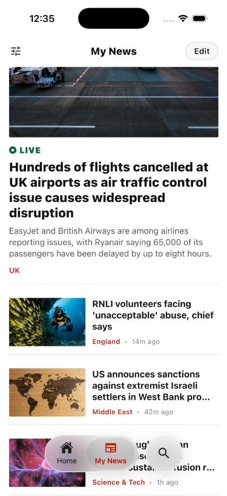
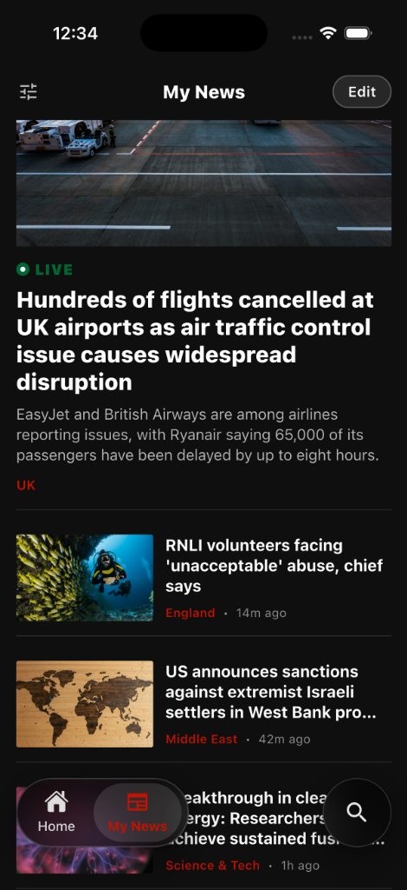
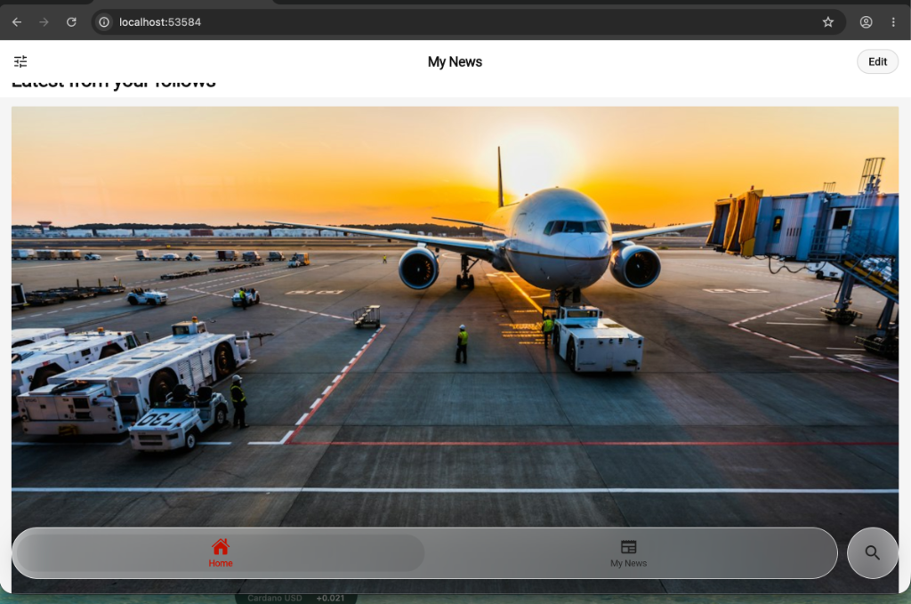

# glass_menu

[](https://pub.dev/packages/glass_menu)
[](https://opensource.org/licenses/MIT)

A customizable, lightweight frosted glass (liquid glassmorphism) navigation bar and menu for Flutter. Built entirely with native Flutter primitives (`BackdropFilter`, specular gradients, rim lighting, ambient shadows) with **zero third-party dependencies**.

Designed to look and feel like modern iOS liquid glass navigation bars.

<p align="center">
  
  &nbsp;&nbsp;
  
  &nbsp;&nbsp;
  
</p>

---

## ✨ Features

- 🧊 **Native Frosted Glass**: Built-in real-time backdrop blur (`BackdropFilter`) and specular rim light gradients.
- 📐 **Multiple Sizing Modes**:
  - `wrapContent`: Sizes snugly around items (perfect for centered floating capsules on mobile, tablet, and desktop).
  - `expandable`: Collapses into a compact `"Menu"` glass button that fluidly animates open when tapped.
  - `fullWidth`: Edge-to-edge docked bar layout.
- 📜 **Anti-Overflow Horizontal Scrolling**: Smooth scrolling with touch, mouse-drag, and trackpad support for 2 to 10+ items without `RenderFlex` overflows.
- 🎨 **Deep Customization (`GlassMenuStyle`)**:
  - Custom font family, font sizes, weights, and letter spacing.
  - Custom active and inactive colors for icons and labels.
  - Customizable active indicator capsule (color, border radius, padding).
  - Configurable blur intensity (sigma), glass surface opacity, borders, and drop shadows.
- 📍 **Arbitrary Positioning (`GlassMenuPosition`)**:
  - `bottomCenter`, `bottomLeft`, `bottomRight`, `topCenter`, `topLeft`, `topRight`, `centerLeft`, `centerRight`.
- 🔍 **Detached Circular Glass Buttons**: Pre-built `SearchGlassButton` with optional visibility (`showSearchButton`), configurable spacing (`actionSpacing`), and opposite-edge alignment (`expandSpaceBetween`).
- 🚀 **Zero Dependencies**: Lightweight and future-proof across iOS, Android, macOS, Web, Windows, and Linux.

---

## 📦 Installation

Add `glass_menu` to your `pubspec.yaml`:

```yaml
dependencies:
  glass_menu: ^1.1.0
```


Or run:

```bash
flutter pub add glass_menu
```

---

## 🚀 Quick Start

### 1. Simple Centered Glass Navigation Bar

```dart
import 'package:flutter/material.dart';
import 'package:glass_menu/glass_menu.dart';

class HomeScreen extends StatefulWidget {
  const HomeScreen({super.key});

  @override
  State<HomeScreen> createState() => _HomeScreenState();
}

class _HomeScreenState extends State<HomeScreen> {
  int _currentIndex = 0;

  @override
  Widget build(BuildContext context) {
    return Scaffold(
      body: Stack(
        children: [
          // Your scrollable content here
          ListView.builder(
            itemCount: 30,
            itemBuilder: (context, i) => ListTile(title: Text('Item $i')),
          ),

          // Floating Frosted Glass Menu
          GlassMenu.positioned(
            position: GlassMenuPosition.bottomCenter,
            sizeMode: GlassMenuSizeMode.wrapContent,
            currentIndex: _currentIndex,
            onItemSelected: (index) => setState(() => _currentIndex = index),
            items: const [
              GlassMenuItem(icon: Icons.home_filled, label: 'Home'),
              GlassMenuItem(
                icon: Icons.newspaper_rounded,
                label: 'My News',
                activeColor: Color(0xFFC41200),
              ),
            ],
            trailingAction: SearchGlassButton(
              onTap: () {
                // Handle search action
              },
            ),
          ),
        ],
      ),
    );
  }
}
```

---

### 2. Expandable "Menu" Pill with Multiple Options

```dart
GlassMenu.positioned(
  position: GlassMenuPosition.bottomCenter,
  sizeMode: GlassMenuSizeMode.expandable,
  style: const GlassMenuStyle(
    collapsedLabel: 'Menu',
    collapsedIcon: Icons.menu_rounded,
    activeColor: Color(0xFFC41200),
  ),
  currentIndex: _selectedIndex,
  onItemSelected: (index) => setState(() => _selectedIndex = index),
  items: const [
    GlassMenuItem(icon: Icons.home, label: 'Home'),
    GlassMenuItem(icon: Icons.newspaper, label: 'News'),
    GlassMenuItem(icon: Icons.sensors, label: 'Live'),
    GlassMenuItem(icon: Icons.play_circle, label: 'Videos'),
    GlassMenuItem(icon: Icons.bookmark, label: 'Saved'),
  ],
)
```

---

## 🛠 Customization (`GlassMenuStyle`)

| Property | Type | Default | Description |
| :--- | :--- | :--- | :--- |
| `blur` | `double` | `24.0` | Blur sigma for the backdrop filter. |
| `opacity` | `double` | `0.52` | Translucency opacity (0.0 - 1.0). |
| `tintColor` | `Color?` | Auto | Surface tint color (adapts to light/dark themes). |
| `borderColor` | `Color?` | Auto | Specular rim highlight border color. |
| `borderWidth` | `double` | `1.2` | Rim border stroke width. |
| `height` | `double` | `68.0` | Total height of the capsule. |
| `activeColor` | `Color` | `#C41200` | Accent color for active icon and label. |
| `inactiveColor` | `Color?` | Auto | Color for inactive icons and labels. |
| `iconSize` | `double` | `24.0` | Icon size. |
| `textStyle` | `TextStyle?` | Auto | Base text style (fontFamily, fontSize, weight). |
| `activeTextStyle` | `TextStyle?` | Auto | Active text style override. |
| `collapsedLabel`| `String` | `'Menu'` | Label shown when expandable menu is collapsed. |
| `collapsedIcon` | `IconData` | `Icons.menu` | Icon shown on collapsed button. |

---

## 📱 Example App

A full sample news application demonstrating all sizing modes, scrolling, and positioning is included in the [`example/`](https://github.com/unshami/glass_menu/tree/main/example) directory.

To run the example:

```bash
cd example
flutter run
```

---

## 📄 License

This project is licensed under the MIT License - see the [LICENSE](LICENSE) file for details.
